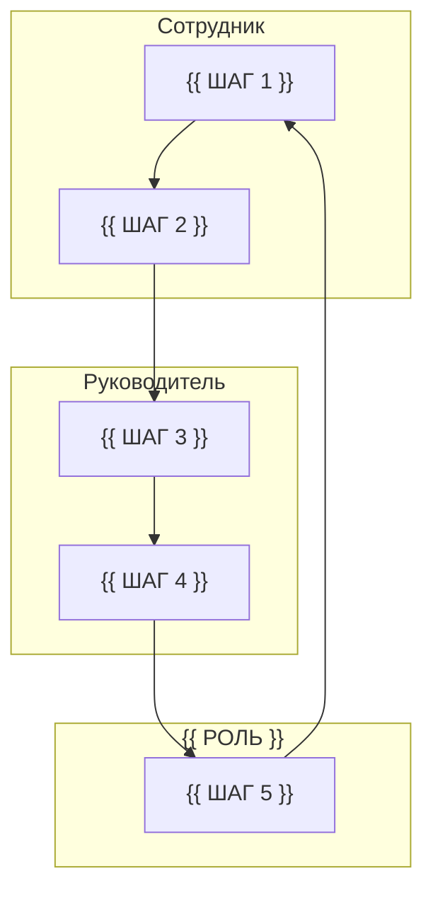

# Анализ процесса AS-IS

<!--
  Этап 2. Показываем, как процесс устроен сегодня, и доказательно определяем,
  где именно он не работает.

  Обязательные элементы, которые проверяет валидатор:
  - раздел «Границы процесса»;
  - хотя бы одна диаграмма ```mermaid``` с подграфами по ролям;
  - таблица шагов с ролью, входом, выходом, системой, временем и частотой.

  Перед сдачей удалите пометки ЗАПОЛНИТЕ и подстановки в двойных скобках.
-->

## Границы процесса

<!-- ЗАПОЛНИТЕ -->

| Граница | Событие |
|---|---|
| Начало | {{ СОБЫТИЕ, с которого процесс стартует }} |
| Конец | {{ СОСТОЯНИЕ, которого достигает сотрудник }} |
| Вне процесса | {{ ЧТО СОЗНАТЕЛЬНО НЕ МОДЕЛИРУЕМ }} |

Процесс должен быть обозрим: 7–15 шагов. Если получается больше —
процесс разбит на несколько, выберите один и укажите это в границах.

## Диаграмма процесса

<!--
  ЗАПОЛНИТЕ: подграфы соответствуют ролям из таблицы шагов.
  Все узлы диаграммы должны быть описаны в таблице ниже, и наоборот.
-->



## Шаги процесса

| # | Шаг | Роль | Вход | Выход | Система | Время | Частота | Ожидание |
|---|---|---|---|---|---|---|---|---|
| 1 | {{ ШАГ }} | {{ РОЛЬ }} | {{ ВХОД }} | {{ ВЫХОД }} | {{ СИСТЕМА }} | {{ ВРЕМЯ }} | {{ ЧАСТОТА }} | да / нет |
| 2 | {{ ШАГ }} | {{ РОЛЬ }} | {{ ВХОД }} | {{ ВЫХОД }} | {{ СИСТЕМА }} | {{ ВРЕМЯ }} | {{ ЧАСТОТА }} | да / нет |

## Источники данных

| Что утверждаем | Источник | Тип | Как получен |
|---|---|---|---|
| {{ УТВЕРЖДЕНИЕ }} | {{ ИСТОЧНИК }} | интервью / наблюдение / документ / тикет / метрика | {{ КАК }} |

Если утверждение основано на документе, а не на наблюдении, — укажите это явно.
Расхождение нормы и практики само по себе ценная находка.

## Обнаруженные проблемы

<!-- ЗАПОЛНИТЕ: классифицируйте, у каждой проблемы есть влияние -->

| # | Проблема | Тип | Влияние | Источник |
|---|---|---|---|---|
| 1 | {{ ПРОБЛЕМА }} | {{ ЛИШНИЙ ШАГ / ОЖИДАНИЕ / ДУБЛИРОВАНИЕ / НЕВИДИМОЕ ЗНАНИЕ / ТОЧКА ОТКАЗА / ПОТЕРЯ МОТИВАЦИИ }} | {{ ВЛИЯНИЕ }} | {{ ИСТОЧНИК }} |

Отметьте отдельно места, где сотрудник обходит процесс. Если обходной путь
нужен для работы, проблема признана участниками и решена в обход регламента —
это сильный аргумент в пользу автоматизации.

## Оценка потерь

<!-- ЗАПОЛНИТЕ: считать необязательно, но оценка делает обоснование проверяемым -->

```text
Потери времени = (время ожидания + время обработки) × частота

{{ ПРИМЕР РАСЧЁТА ПО ОДНОЙ МЕТРИКЕ }}
```

## Связь с этапом 1

| Проблема AS-IS | Противоречие из 01_problem.md |
|---|---|
| {{ ПРОБЛЕМА }} | {{ ПРОТИВОРЕЧИЕ }} |

Каждая найденная проблема должна иметь соответствие в постановке задачи.
Если проблема не вытекает из противоречия — возможно, это не ваша проблема.

Методические указания: раздел «Методика → Как моделировать процесс AS-IS»
в репозитории `hrtech-practice`.
