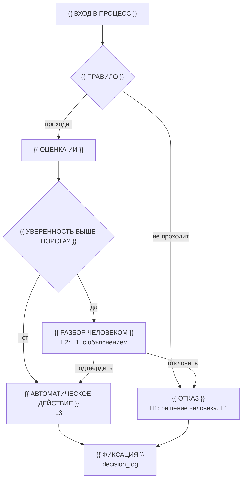
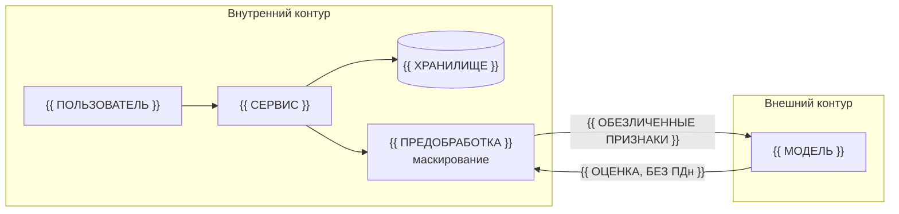

# Целевой процесс и архитектура решения

<!--
  Этап 3. Самый оцениваемый документ практики: 30 баллов за архитектуру
  и 30 баллов за проработку рисков ИИ и корректности HITL.

  Валидатор требует непустую секцию «Human-in-the-Loop». Одна строка
  «человек подтверждает решение» требованию не удовлетворяет: нужны
  условия срабатывания, право на отказ, эскалация и срок.

  Перед сдачей удалите пометки ЗАПОЛНИТЕ и подстановки в двойных скобках.
-->

## Целевой процесс



## Обоснование альтернатив

<!-- ЗАПОЛНИТЕ: рассмотрены варианты, выбран один, выбор обоснован -->

| Вариант | Описание | Почему не выбран | Почему выбран |
|---|---|---|---|
| {{ ВАРИАНТ }} | {{ ОПИСАНИЕ }} | {{ ПРИЧИНА }} | {{ ПРИЧИНА }} |

Отдельно ответьте: почему здесь нужен ИИ, а не детерминированное правило?

## Архитектура решения

| Компонент | Назначение | Ответственность |
|---|---|---|
| {{ КОМПОНЕНТ }} | {{ НАЗНАЧЕНИЕ }} | {{ ОТВЕТСТВЕННОСТЬ }} |

## Границы контура данных



| Данные | Где хранится | Что уходит наружу | Чем защищено |
|---|---|---|---|
| {{ ДАННЫЕ }} | {{ ГДЕ }} | {{ ЧТО УХОДИТ }} | {{ ЗАЩИТА }} |

Если всё остаётся во внутреннем контуре, скажите это прямо —
это сильный и честный ответ на риски утечки.

## Human-in-the-Loop

<!--
  Обязательная секция. Валидатор проверяет её наличие и непустоту.
  Проверьте себя: точки вмешательства без условия срабатывания —
  это не точки вмешательства, это декларация.
-->

### Уровни автоматизации

| Уровень | Что делает система | Где применять |
|---|---|---|
| L0 | человек делает всё, система хранит | {{ ГДЕ }} |
| L1 | система готовит сводку, человек решает | {{ ГДЕ }} |
| L2 | система предлагает с обоснованием, человек подтверждает | {{ ГДЕ }} |
| L3 | система действует сама ниже порога риска | {{ ГДЕ }} |
| L4 | система действует без участия человека | {{ ГДЕ }} |

Правило выбора: чем выше цена ошибки, тем ниже уровень. Уровень
определяется ставкой ошибки, а не возможностями модели.

### Точки вмешательства

| ID | Точка решения | Уровень | Условие срабатывания | Право на отказ | Срок | Эскалация | Куда попадает лог |
|---|---|---|---|---|---|---|---|
| H1 | {{ ТОЧКА }} | L1 | {{ УСЛОВИЕ }} | да, с причиной | {{ СРОК }} | {{ КОМУ }} | {{ ЛОГ }} |
| H2 | {{ ТОЧКА }} | L1 | {{ УСЛОВИЕ }} | да, с причиной | {{ СРОК }} | {{ КОМУ }} | {{ ЛОГ }} |

Для необратимых решений — увольнение, отказ в найме, отказ в повышении —
уровень не может быть выше L1.

### Объяснимость

Приведите реальный пример вывода системы. Фраза «модель объяснима»
без примера не проходит критерий.

```text
Пример решения: {{ ОЦЕНКА }}.
Повлиявшие признаки: {{ ПРИЗНАКИ И НАПРАВЛЕНИЕ ВЛИЯНИЯ }}.
Использованные данные: {{ ДАННЫЕ }}.
Почему не на единицу выше: {{ ОБЪЯСНЕНИЕ }}.
Что проверить человеку: {{ ЧТО }}.
```

### Право на отказ и эскалация

| Точка | Может ли человек отклонить | Что происходит при отказе | Что если не ответил |
|---|---|---|---|
| H1 | {{ ДА / НЕТ }} | {{ ПОСЛЕДСТВИЕ }} | {{ ЭСКАЛАЦИЯ }} |

## Риски ИИ и контрмеры

| Риск | Категория | Сценарий | Контрмера в архитектуре | Уровень контроля | Проверка |
|---|---|---|---|---|---|
| {{ РИСК }} | справедливость / прозрачность / данные / надёжность / влияние на людей / право | {{ СЦЕНАРИЙ }} | {{ КОНТРМЕРА }} | {{ H/L }} | {{ КАК ПРОВЕРЯЕМ }} |

Пройдите чек-лист рисков из методических указаний и отметьте, какие риски
вы **приняли** сознательно, а какие смягчили.

Принятые сознательно риски: {{ РИСКИ И ОБОСНОВАНИЕ }}.

## Логирование и аудит

```text
{{ decision_id, timestamp, actor_id, system_version, input_hash,
   features_used, model_output, confidence, human_action,
   override_reason, escalation_state }}
```

`input_hash` обязателен: без него невозможно доказать, что решение
принималось по заявленным данным, и невозможно его оспорить.

Методические указания: раздел «Методика → Целевой процесс и контур
Human-in-the-Loop» в репозитории `hrtech-practice`.
